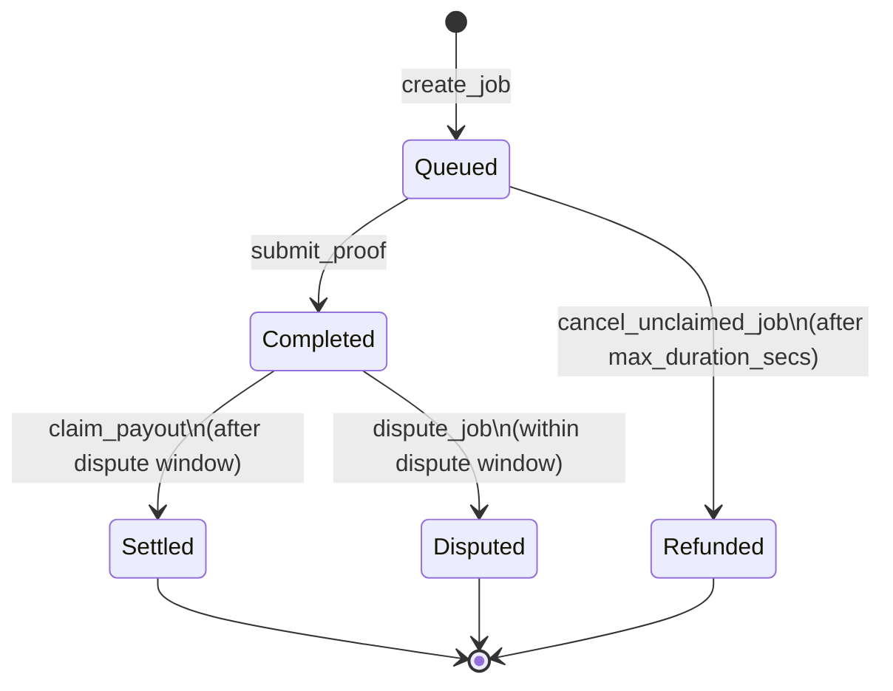

<p align="center">
  
</p>

<p align="center">
  <a href="LICENSE"></a>
  <a href="https://stellar.org/soroban"></a>
  <a href="https://www.rust-lang.org"></a>
  <a href="../../actions/workflows/ci.yml"></a>
  <a href="https://pulserun-labs.github.io/pulserun-core/"></a>
</p>

# PulseRun Core

On-chain **escrow and settlement** for [PulseRun](https://pulserun.com), a
pay-per-run compute and CI runner protocol. A requester locks a budget on-chain
before a job starts; a runner executes the job and submits a metered proof; a
Soroban smart contract pays for the seconds actually executed and returns the
unspent remainder. No invoices, no trust, no custodians.

This repository is the **contracts** half of PulseRun. The application layer
lives in [`pulserun-client`](https://github.com/PulseRun-Labs/pulserun-client).

📖 **[Documentation](https://pulserun-labs.github.io/pulserun-core/)** — the
full protocol mechanics, contract reference, and per-persona guides are
published on GitHub Pages.

---

## Contents

- [Why PulseRun](#why-pulserun)
- [Built on Stellar & Soroban](#built-on-stellar--soroban)
- [Maintainers](#maintainers)
- [Architecture](#architecture)
- [Job lifecycle](#job-lifecycle)
- [Settlement math](#settlement-math)
- [Repository layout](#repository-layout)
- [Contract API](#contract-api)
- [Quick start](#quick-start)
- [Security model](#security-model)
- [Contributing](#contributing)
- [License](#license)

---

## Why PulseRun

Compute and CI work is metered and bursty, but it is almost always paid for
retroactively. That mismatch has a measurable cost:

- **27% of cloud spend is wasted**, mostly on idle or over-provisioned resources
  ([Flexera, *State of the Cloud 2025*](https://www.flexera.com/)).
- An estimated **21% of enterprise cloud infrastructure spend — $44.5B in 2025 —
  goes to underutilized resources**
  ([Harness, *FinOps in Focus*](https://www.prnewswire.com/news-releases/44-5-billion-in-infrastructure-cloud-waste-projected-for-2025-due-to-finops-and-developer-disconnect-finds-finops-in-focus-report-from-harness-302385580.html)).
- **83% of container cost is associated with idle resources**
  ([Datadog](https://www.datadoghq.com/state-of-cloud-costs/)).

Pay-per-run inverts the payment model so a payer never funds idle capacity and a
runner is funded before starting. The escrow enforces the terms on both sides:

| Property | Mechanism |
| --- | --- |
| A runner is always funded | `create_job` transfers the full `max_budget` into the contract before the job is written. |
| A requester can never be overbilled | Proof durations are bounded by `max_duration_secs` and payout is hard-capped at `max_budget`. |
| Either side can escalate | Payout is frozen for `dispute_window_secs`; `dispute_job` halts it pending resolution. |

## Built on Stellar & Soroban

Stellar and Soroban are not decorative here — the protocol is only possible
because of what the network provides:

- **Soroban smart contracts are the escrow.** The budget is custodied by a
  `#[contract]` deployed to Soroban. Without an on-chain contract VM that can
  hold and transfer value under program logic, there is no trustless escrow to
  build.
- **Settlement in Stellar assets via the Stellar Asset Contract (SAC).** Jobs
  settle in any SEP-41 token, including the SAC of a Stellar-issued asset such
  as a stablecoin — so requesters pay in the asset they already hold, with no
  wrapping or bridged counterparty.
- **Metering is economically viable because settlement is cheap and fast.**
  Pay-per-run only works if settling a single run is cheap relative to the run.
  Stellar's low fees and roughly five-second ledger close make per-job
  settlement practical where a per-transaction fee of dollars would make it
  absurd.
- **Authorization and account model.** `Address::require_auth` on requesters and
  runners gives the contract cryptographic proof of who agreed to the terms,
  including for smart-wallet (contract) accounts.
- **Ledger time drives the protocol.** The dispute window and the unclaimed-job
  timeout are both measured against `env.ledger().timestamp()`, so the clock is
  the network's, not an operator's.
- **Deterministic WASM.** Contracts compile to `wasm32v1-none` and deploy
  through the Stellar toolchain, so the settlement logic that runs on-chain is
  the logic in this repo, verifiable byte for byte.

If you lifted this design onto a chain without a general-purpose contract VM, or
without an on-chain asset rail to settle in, it would not exist. That is the
point.

## Maintainers

<table align="center">
  <tr>
    <td align="center">
      <strong>Adesh</strong>
      <br />
      <a href="https://github.com/Adesh-tech09">@Adesh-tech09</a>
      <br />
      <a href="https://t.me/PLACEHOLDER_TELEGRAM">Telegram</a>
    </td>
  </tr>
</table>

<!-- TODO: replace PLACEHOLDER_TELEGRAM with the maintainer's real handle, and
     add teammates as extra <td> cells if there are more maintainers. -->

## Architecture

```text
        create_job (locks max_budget)          submit_proof
┌───────────┐  ───────────────────────►  ┌──────────────┐  ───────────►  ┌────────────┐
│ Requester │                            │    Escrow    │                │   Runner   │
└───────────┘  ◄───────────────────────  │  (this repo) │  ◄───────────  └────────────┘
     │            claim_payout (dust)    └──────────────┘    earnings
     │                 │                       │  ▲
     │                 │                       ▼  │
     │         ┌───────────────┐        ┌───────────────┐
     └────────►│ dispute_job   │        │ payment_token │  (SEP-41 / SAC)
               │ (halts payout)│        └───────────────┘
               └───────────────┘
```

### Job lifecycle



### Settlement math

```text
duration     = proof.duration_secs            (validated: 1 ..= max_duration_secs)
earnings     = min(rate_per_second * duration, max_budget)   (runner)
refund       = max_budget - earnings                         (requester)
```

Because `create_job` escrows the whole `max_budget`, settlement is fully
self-contained: it only ever moves money already in the contract, so it cannot
fail for lack of funds. Full mechanics:
[`docs/protocol-mechanics.md`](docs/protocol-mechanics.md).

## Repository layout

```text
pulserun-core/
├── contracts/
│   ├── escrow/          # PulseEscrow: escrow + settlement
│   │   └── src/
│   │       ├── lib.rs       # entrypoints
│   │       ├── types.rs     # ComputeJob, ExecutionProof, JobStatus
│   │       ├── storage.rs   # keys, TTL policy, accessors
│   │       ├── errors.rs    # stable error codes
│   │       └── test.rs      # integration-style unit tests
│   └── mock_token/      # minimal SEP-41-style token for tests
├── docs/                # documentation source (mdBook → GitHub Pages)
├── scripts/             # deploy + issue-generation tooling
├── .github/workflows/   # CI: fmt, clippy, test, wasm build
└── Cargo.toml           # workspace
```

## Contract API

`PulseEscrow` (`contracts/escrow`):

| Function | Access | Description |
| --- | --- | --- |
| `init(admin, dispute_window_secs)` | admin | One-time setup of the administrator and dispute window. |
| `create_job(requester, runner, token, max_budget, rate_per_second, max_duration_secs) -> u64` | requester | Locks collateral, returns the new `job_id`. |
| `submit_proof(runner, proof)` | runner | Records the proof, locks the output hash, opens the dispute window. |
| `claim_payout(job_id) -> i128` | anyone | After the window: pays the runner, refunds dust to the requester. |
| `dispute_job(requester, job_id)` | requester | Within the window: halts automatic payout. |
| `cancel_unclaimed_job(requester, job_id)` | requester | After `max_duration_secs`: refunds a still-`Queued` job in full. |
| `get_job` / `get_proof` / `job_count` / `dispute_window` / `admin` | view | Read-only accessors. |

Full reference including error codes:
[`docs/contract-reference.md`](docs/contract-reference.md).

## Quick start

Everything runs with a stock Rust toolchain — no Stellar CLI, no Docker, no
network services.

```bash
# 1. One-time toolchain setup (Rust 1.84+ for the wasm32v1-none target).
rustup target add wasm32v1-none
rustup component add rustfmt clippy

# 2. Run the full test suite (27 tests, including token settlement).
cargo test --all

# 3. Match CI exactly.
cargo fmt --all -- --check
cargo clippy --all-targets -- -D warnings

# 4. Compile the deployable contracts.
SOROBAN_SDK_BUILD_SYSTEM_SUPPORTS_SPEC_SHAKING_V2=1 \
  cargo build --target wasm32v1-none --release -p pulserun-escrow -p mock-token
```

Artifacts land in `target/wasm32v1-none/release/{pulserun_escrow,mock_token}.wasm`.

> **Why the env var?** `soroban-sdk` v28 refuses to emit a contract wasm unless
> the build system advertises spec-shaking support; the Stellar CLI sets that
> flag itself. Setting it manually lets plain `cargo` compile wasm for CI and
> local checks. **For real deployments, prefer `stellar contract build`**, which
> produces a properly spec-shaken, canonical artifact.

### Deploying (testnet)

```bash
./scripts/deploy-testnet.sh        # builds, deploys in order, prints contract ids
```

The script configures the network and identity, deploys `mock_token` then the
escrow (the escrow settles in a token), calls `init`, and prints
copy-pasteable contract ids. See
[`docs/deployments/testnet.md`](docs/deployments/testnet.md) to record them.

## Security model

- **Authorization** — every mutating entrypoint calls `Address::require_auth`
  on the exact party it constrains (`requester`, `runner`, or `admin`). The
  supplied address is validated against the stored job record *before*
  authorization, so an impostor cannot spend someone else's signature.
- **Checks-effects-interactions** — `claim_payout` marks the job `Settled`
  before any token transfer, so a re-entrant token cannot double-settle.
- **Checked arithmetic** — settlement math uses `checked_mul`/`checked_add` and
  the release profile keeps `overflow-checks = true`.
- **Bounded liability** — payout can never exceed the locked `max_budget`, and
  billable time can never exceed `max_duration_secs`.

This code is **unaudited**. Treat it as a reference implementation and get an
independent review before mainnet use. See [`SECURITY.md`](SECURITY.md) to
report a vulnerability privately.

## Contributing

Contributions are welcome through pull requests. Every change runs the CI gate
(`fmt`, `clippy -D warnings`, `test`, wasm build). Start with
[`CONTRIBUTING.md`](CONTRIBUTING.md); open work is listed in the
[issue backlog](https://github.com/PulseRun-Labs/pulserun-core/issues).

<a href="https://github.com/PulseRun-Labs/pulserun-core/graphs/contributors">
  
</a>

## License

[MIT](LICENSE) © 2026 PulseRun Labs
