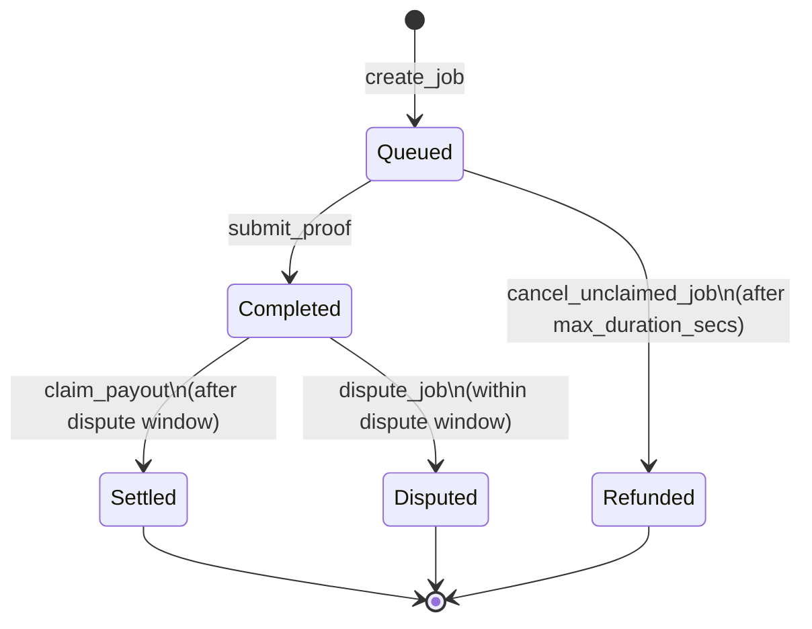

# PulseRun Core

[](LICENSE)
[](https://stellar.org/soroban)
[](https://github.com/PulseRun-Labs/pulserun-core/actions/workflows/ci.yml)

On-chain **escrow and settlement** for [PulseRun](https://pulserun.com), a
pay-per-run compute and CI runner protocol on [Stellar](https://stellar.org).
A requester locks a budget up front; a runner executes a job and submits a
metered proof; the contract pays for the seconds actually executed and returns
the unspent remainder. No invoices, no trust, no custodians.

---

## Why it exists

CI and compute work is metered and bursty, but payment is usually batched and
retroactive. PulseRun inverts that: **the money is already on the table before
the job starts**. The escrow contract enforces three properties that make
pay-per-run safe for both sides:

| Property | Mechanism |
| --- | --- |
| A runner is always funded | `create_job` transfers the full `max_budget` into the contract before the job is written. |
| A requester can never be overbilled | Proof durations are bounded by `max_duration_secs` and payout is hard-capped at `max_budget`. |
| Either side can escalate | Payout is frozen for `dispute_window_secs`; `dispute_job` halts it indefinitely pending resolution. |

---

## Architecture

```text
        create_job (locks max_budget)          submit_proof
┌───────────┐  ───────────────────────►  ┌──────────────┐  ───────────►  ┌────────────┐
│ Requester │                            │    Escrow    │                │   Runner   │
└───────────┘  ◄───────────────────────  │  (this repo) │  ◄───────────  └────────────┘
     │            claim_payout (dust)    └──────────────┘    earnings
     │                 │                       │  ▲
     │                 │                       ▼  │
     │         ┌───────────────┐        ┌───────────────┐
     └────────►│ dispute_job   │        │ payment_token │  (SEP-41 / SAC)
               │ (halts payout)│        └───────────────┘
               └───────────────┘
```

### Job lifecycle



### Settlement math

```text
elapsed      = proof.duration_secs            (validated: 1 ..= max_duration_secs)
metered      = rate_per_second * elapsed
earnings     = min(metered, max_budget)       (runner)
refund       = max_budget - earnings          (requester)
```

Because `create_job` escrows the whole `max_budget`, settlement is fully
self-contained: it only ever moves money that is already in the contract, so it
cannot fail for lack of funds.

---

## Repository layout

```text
pulserun-core/
├── contracts/
│   ├── escrow/          # PulseEscrow: escrow + settlement
│   │   └── src/
│   │       ├── lib.rs       # entrypoints
│   │       ├── types.rs     # ComputeJob, ExecutionProof, JobStatus
│   │       ├── storage.rs   # keys, TTL policy, accessors
│   │       ├── errors.rs    # stable error codes
│   │       └── test.rs      # integration-style unit tests
│   └── mock_token/      # minimal SEP-41-style token for tests
├── .github/workflows/   # CI: fmt, clippy, test, wasm build
└── Cargo.toml           # workspace
```

---

## Contract API

`PulseEscrow` (`contracts/escrow`):

| Function | Access | Description |
| --- | --- | --- |
| `init(admin, dispute_window_secs)` | admin | One-time setup of the administrator and dispute window. |
| `create_job(requester, runner, token, max_budget, rate_per_second, max_duration_secs) -> u64` | requester | Locks collateral, returns the new `job_id`. |
| `submit_proof(runner, proof)` | runner | Records the proof, locks the output hash, opens the dispute window. |
| `claim_payout(job_id) -> i128` | anyone | After the window: pays the runner, refunds dust to the requester. |
| `dispute_job(requester, job_id)` | requester | Within the window: halts automatic payout. |
| `cancel_unclaimed_job(requester, job_id)` | requester | After `max_duration_secs`: refunds a still-`Queued` job in full. |
| `get_job` / `get_proof` / `job_count` / `dispute_window` / `admin` | view | Read-only accessors. |

Error codes are enumerated in [`contracts/escrow/src/errors.rs`](contracts/escrow/src/errors.rs)
and are part of the public ABI — branch on the numeric value, not the name.

---

## Zero-friction local build & test

Everything runs with a stock Rust toolchain — no Stellar CLI, no Docker, no
network services.

```bash
# 1. One-time toolchain setup (Rust 1.84+ for the wasm32v1-none target).
rustup target add wasm32v1-none
rustup component add rustfmt clippy

# 2. Run the full test suite (27 tests, including token settlement).
cargo test --all

# 3. Match CI exactly.
cargo fmt --all -- --check
cargo clippy --all-targets -- -D warnings

# 4. Compile the deployable contracts.
SOROBAN_SDK_BUILD_SYSTEM_SUPPORTS_SPEC_SHAKING_V2=1 \
  cargo build --target wasm32v1-none --release -p pulserun-escrow -p mock-token
```

Artifacts land in `target/wasm32v1-none/release/{pulserun_escrow,mock_token}.wasm`.

> **Why the env var?** `soroban-sdk` v28 refuses to emit a contract wasm unless
> the build system advertises spec-shaking support; the Stellar CLI sets that
> flag itself. Setting it manually lets plain `cargo` compile wasm for CI and
> local checks. **For real deployments, prefer `stellar contract build`**, which
> produces a properly spec-shaken, canonical artifact.

### Deploying (testnet)

```bash
stellar contract build
stellar contract deploy \
  --wasm target/wasm32v1-none/release/pulserun_escrow.wasm \
  --network testnet --source <your-identity>

stellar contract invoke --id <contract-id> --network testnet --source <your-identity> \
  -- init --admin <admin-address> --dispute_window_secs 86400
```

---

## Security model

- **Authorization** — every mutating entrypoint calls `Address::require_auth`
  on the exact party it constrains (`requester`, `runner`, or `admin`). The
  supplied address is validated against the stored job record *before*
  authorization so an impostor cannot spend someone else's signature.
- **Checks-effects-interactions** — `claim_payout` marks the job `Settled`
  before any token transfer, so a re-entrant token cannot double-settle.
- **Checked arithmetic** — settlement math uses `checked_mul`/`checked_add` and
  the release profile keeps `overflow-checks = true`.
- **Bounded liability** — payout can never exceed the locked `max_budget`, and
  billable time can never exceed `max_duration_secs`.

This code is unaudited. Treat it as a reference implementation and get an
independent review before mainnet use.

---

## Contributing

We participate in **Drips Wave**. Issues are labeled by effort — `100pts`
(trivial), `150pts` (medium), `200pts` (high) — and every change runs the
standard CI gate. See [CONTRIBUTING.md](CONTRIBUTING.md) to get started.

## License

[MIT](LICENSE) © 2026 PulseRun Labs
